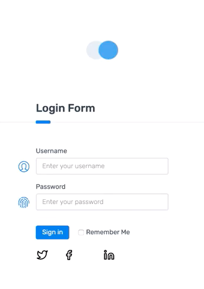
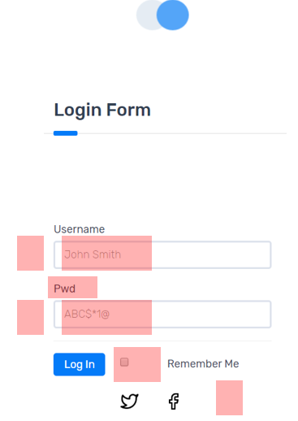

# Sleeping Better At Night

Here's the [talk link](https://egghead.io/lessons/egghead-egghead-talks-sleeping-better-at-night)

## Why are you afraid of pushing to production of Friday?

Your code doesn't care about which day of the week it is, it doesn't know the difference between tuesday and friday so why should you?

Here's a useful diagram that demonstrates  the probability you'll break the production build using your YOLO (You Only Live Once) change:

So this brings up an important question: can you avoid this fear of breaking production on Friday? Well the answer is yes. By **testing your code.**

As software developers, we constantly keep asking the same question when writing code :

>"Does this code actually work?"

but before answering that, we should ask a more important question:

>Why do we care in the first place ?

Writing code with a couple of bugs is actually normal. If you push to production and there's a bug, it's not the end of the day, you'll still get paid. (Of course if you ship really buggy unmaintainable code then yes you've got a  problem).

But this is about something else entirely, it's about **empathy**.

Firstly, there's empathy for your users. You care about there experience. especially if you're building an app that helps them make a living (Publishing videos, selling items, selling services, etc.)

Secondly, there's empathy for other team members. We don't want to make a YOLO change that might break production and force other team members to work  during their time off.

Finally, we care because it makes us feel _safe_. We don't want to worry about work all the time when we're at home

## The Testing Spectrum

This is what the testing spectrum looks like:

---

Testing comes in many shapes and forms:

### **linting & formatting tools**

Linting tools when (i.e. [ESLint](https://eslint.org/)) combined with formatting tools ( i.e. [Prettier](https://prettier.io/)) count as testing.

Why? because when you press `ctrl+S` to save, if your code isn't formatting, this means you have a syntax error. And you won't push code that isn't properly formatted.

ESLint also helps in catching bugs; for example, you may have written a function and it's not working, only to find out you haven't called the function in the first place.


<!-- insert meme about calling the function -->

### **Types**

strongly-typed code means you're defining the types of variables you're using in your code.
You'll define the return type of a function, the types of variables you're passing to the function, etc.
Using a strongly typed language (like [TypeScript](https://www.typescriptlang.org/)) helps in preventing a lot of bugs.

Having types is great but even 100% typed code has bugs. Think of apps written in a strongly typed language like Java or C++, they have bugs.

```ts
// this code is in TypeScript, which is strict syntactical super-set of JavaScript

// here we're explicitly declaring that the variable called name can only hold string values

let name:string = "Tomasz";


// here we're explicitly declaring that the variable called age can only hold numbers
let age:number = 30;

// add function in JavaScript
// we can pass two strings to the function and it will work, but that's not the functionality we want

function add = (a, b)=>{
    return a + b;
}

// add function in TypeScript
// we're defining the types of the function parameters and the type of its return value

function add(a: number, b: number): number {
    return a + b;
}

```

### **Unit Tests**

Unit testing is when you test a component on its own and making sure that it works as expected.

<!-- test coverage meaning -->

>Test coverage is defined as a technique which determines whether our test cases are actually covering the application code and how much code is exercised

Why you shouldn't aim for 100% test coverage.

Having 100% test coverage doesn't reflect confidence in your software. Unit tests don't protect you against misunderstanding the requirements.

Okay, if you're not going to test all of your code, which parts should you test? Which percent of coverage should you aim for?

One popular opinion about writing tests, is to make sure that your tests resemble the software used

<!-- Kent C Dodds tweet -->

Here's an example of tests that don't resemble the software used.

<!-- bad test example code snippet-->

>If you change the implementation of a component, for example you changed it from a React component to a Vue component (Same behavior just different code), your tests should still pass.

A great example of a library that focuses on testing  what the user sees and interacts with is [testing library](https://testing-library.com/).

Here's an example of a test:

<!-- testing  lib code snippet-->

Writing tests this way, gives you confidence in your software. Because through this testing approach youre answering the question of "Does this code actually work?"

### **UI Testing**

UI testing is important for front-end developers.

Users only care about two things:

- Being able to use your product to accomplish their goals ( Buying something, posting something, etc.)
- To be DONE using your app so that they can move on

For example, no one enjoys ordering an Uber. You need to select a location, which type of car you're going to ride, which payment method you want, etc. We enjoy the value we get from ordering an Uber. Which is arriving at our desired destination.

A cool tool for making sure that your app renders the exact way you want to to render is [Sizzy](https://sizzy.co)

<iframe title="vimeo-player" src="https://player.vimeo.com/video/344319852" width="640" height="414" frameborder="0" allowfullscreen></iframe>

### **E2E Testing**

We should not only care about individual components, but how they fit together. That's why some people believe that unit tests are not important.

More and more teams are moving towards automated tests.

A great testing framework is [Cypress](https://www.cypress.io/).

Tomasz gives a quick demo at **23:30** where he tests a todo-app using Cypress.

Here are two great courses on egghead.io if you're looking to learn more about Cypress:

- [End to End testing with Cypress](https://egghead.io/courses/end-to-end-testing-with-cypress) by Andy Van Slaars
- [Test Production Ready Apps with Cypress](https://egghead.io/courses/test-production-ready-apps-with-cypress) by Brett Cassette

Cypress can't test what the user sees, it can see the DOM, CSS classes, but it doesn't have eyes. This is where Visual Regression comes in.

### **Visual Regression**

An awesome tool for visual testing is [Applitools](https://applitools.com/). It's an AI powered visual testing & monitoring software.

<!-- image explanation of how applitools work -->

This tool allows us to visually catch errors that we might miss.

<!-- show example of output of applitools -->

Here's an example of a form component that will be tested using Applitools



Applitools uses AI to detect any changes UI changes compared to the original version and will highlight the inconsistencies and their cause.



A great talk about Applitools is by Angie Jones, called ["Your Tests Lack Vision: Adding Eyes To Your Automation Framework"](https://www.youtube.com/watch?v=tkU6E0BlltU).

### **User Testing**

Talking to your users is an important aspect of testing that is often overlooked. This is to make sure that what you're building is actually what they need.

Are your users finding value in what you're offering?

The best way to find out is by making them use your software, asking questions and receiving feedback.

A great book about user testing is ["Rocket Surgery made easy" by Steve Krug](https://www.amazon.com/Rocket-Surgery-Made-Easy-Yourself/dp/0321657292). It's short and it teaches you how to talk to your users.

## Key Takeaways

- Care about your users and understand their needs.
- The closer you are to the user (understanding their goals, their behaviors, etc.) === the better tests you'll write. Understanding the user requirements is essential.
- Take care of yourself. No matter how many tests you have, things can still go wrong and that's okay.
